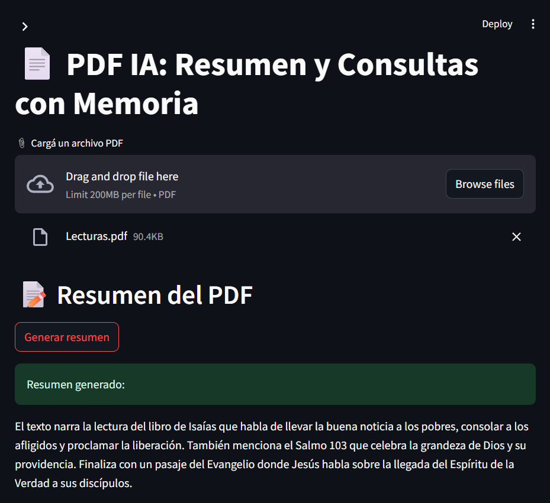

# 📚 PDF AI App - Resumen y Consultas con Memoria

Esta aplicación en Streamlit permite:

- 📌 **Resumir PDFs cargados**
- 🤖 **Realizar consultas específicas** al contenido del PDF usando IA generativa de OpenAI (modo gratuito)
- 🧠 **Memoria conversacional**, para preguntas encadenadas
- 🚫 **Detección automática de preguntas no pertinentes** al documento

---

## 🚀 Tecnologías utilizadas

- [Streamlit](https://streamlit.io/)
- [LangChain](https://www.langchain.com/)
- [OpenAI GPT-3.5-turbo](https://platform.openai.com/)
- [FAISS](https://github.com/facebookresearch/faiss) para búsqueda semántica
- [PyPDF2](https://pypi.org/project/PyPDF2/)
- [dotenv](https://pypi.org/project/python-dotenv/)

---

## 📦 Instalación local

### 1. Clonar repositorio (o crear tu carpeta)

```bash
git clone https://github.com/tu-usuario/pdf-ai-app.git
cd pdf-ai-app
```

### 2. Crear y activar entorno virtual

#### En Windows:

```bash
python -m venv venv
venv\Scripts\activate
```

#### En macOS / Linux:

```bash
python3 -m venv venv
source venv/bin/activate
```

### 3. Instalar dependencias

```bash
pip install -r requirements.txt
```

### 4. Configurar la API Key de OpenAI

Creá un archivo `.env` con tu clave:

```env
OPENAI_API_KEY=sk-tu-api-key-aqui
```

> También podés configurar la clave en `.streamlit/secrets.toml` si desplegás en Streamlit Cloud.

---

## ▶️ Ejecutar la app

```bash
streamlit run app.py
```

---

## 🧪 Funcionalidades

### 📌 Resumen del PDF

- Lee el contenido del PDF cargado
- Genera un resumen automático usando IA generativa

### 🤖 Consultas al documento

- Realiza preguntas con memoria del historial conversacional
- Verifica automáticamente si la consulta es pertinente al documento
- Rechaza preguntas fuera de contexto con un mensaje como:
  > `"Tu consulta no es pertinente con el documento."`

---

## 📸 Vista previa

> 
---

## 🛡️ Licencia

MIT © 2025 Jerónimo Martínez

---

## 🤝 Agradecimientos

- [LangChain](https://www.langchain.com/)
- [OpenAI](https://openai.com/)
- [Streamlit](https://streamlit.io/)
